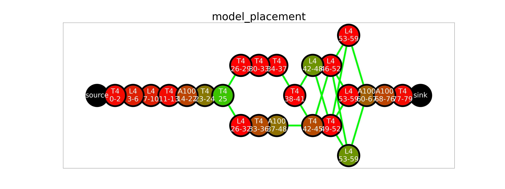

# ASPLOS'25 Helix
## 1. Introduction 
Helix is a distributed system designed for high-throughput, low-latency large language model
serving across heterogeneous and potentially geo-distributed GPU clusters. This repository
contains the official implementation of both Helix's simulator and prototype system. Our paper
can be found here [https://arxiv.org/abs/2406.01566](https://arxiv.org/abs/2406.01566).

## 2. Distributed LLM Serving Simulator Tutorial
The Helix simulator is a high-fidelity discrete-event simulator implemented in Python,
specifically designed for distributed LLM serving across heterogeneous and geo-distributed
GPU clusters. It provides detailed modeling and analysis of system behavior in complex
distributed environments.

### 2.1 Installing Dependencies
We recommend using Python 3.10. To install the required dependencies, run the following command:
```bash
conda create -n runtime python=3.10 -y && conda activate runtime
pip install -e .
```
We use Gurobi as the MILP solver in the simulator, which requires a valid license. Please follow
the instructions on the [Gurobi website](https://www.gurobi.com/) to obtain a license.

### 2.2 Running the Simulator
In this tutorial, we use an example of serving LLaMA-2 70B in a cluster with 24 machines to demonstrate
how to use Helix's simulator. The example is is located in `./examples/simulation`:
```bash
cd examples/simulation
```

#### Step 1: Generate Configuration Files
First, we need to generate a cluster configuration file, which specifies the nodes and network connections
in the cluster. Run the following command to generate example cluster configuration files
```bash
python step1_gen_cluster.py
```
This Python script uses `FakeClusterGenerator` to generate a cluster with 24 machines located in a single
region (`config/single24.ini`) and `PartitionedClusterGenerator` to generate a cluster with 24 machines
located in three different regions (`config/3cluster24.ini`). For generation of other cluster topologies,
please refer to these two helper classes to implement your own generator. The simulator also needs a machine
profile file, which specifies the nic speed and vram size of machines. We provide such an example in
`config/machine_profile.ini`.

#### Step 2: Finding Model Placement Plans
The second step is to find a model placement, which specifies the layers each compute node holds.
In our simulator, we implement our MILP-based model placement method (`ILPLayout`) and three
heuristic-based model placement methods as baselines. Let's first use the heuristic methods to
generate model placements:
```bash
python step2_model_placement.py petals
python step2_model_placement.py swarm
python step2_model_placement.py homogeneous
```
These heuristic-based methods run very fast. However, the quality of the model placement can not
be guaranteed. Then, we use Helix's MILP-based model placement planner to generate high-quality
model placements:

> **Tips:** You need to remove the contents of `./layouts/ilp` directory before running the following
> command. The folder currently contains our results. If you want to compare your results with ours,
> you can move the contents to a backup place. Also, before running the MILP-based model placement
> planner, you need to run `petals` to generate a model placement for LLaMA-2 70B. We bootstrap the
> solver with `petals`' solution.

```bash
python step2_model_placement.py ilp
```
Notice that we set the max running time to 10 hours. However, you can interrupt with `ctrl + c` at
any time, and the best model placement will be saved (press `ctrl + c` only once, otherwise the
process will be killed by the os). On a laptop with 14 cores, we run the solver for around 10
minutes to find the solution in `layouts/ilp`.

After running model placement, we will get a `{method_name}_sol.ini`, which specifies the layers
each compute node holds, and a `simulator_cluster.ini`, which is the cluster description file that
will be used in the simulation. If you are using our MILP-based model placement planner, you will
also get `ilp_model.lp` and `ilp_solution.sol`, which are generated by Gurobi to store the LP
problem and the raw solution.

> **Tips:** If you accidentally press `ctrl + c` twice and kill the process before `simulator_cluster.ini`
> is generated, you still have the chance to recover the results. As long as you have `ilp_solution.sol`,
> you can generate `simulator_cluster.ini` and `ilp_sol.ini` using the method in `verify_ilp.py`.

> **Tips:** It is possible that some compute nodes are not used in the model placement. Also, due
> to different licenses and hardware, you may find different solutions. We empirically find that
> Gurobi optimizes much slower with its default limited license.

#### Step 3: Run Simulation
Finally, we can run the simulate to see how the model placement plan and request scheduling performs:
```bash
python step3_run_simulation.py offline maxflow
```
In this example, we use the model placement found by Helix's MILP-based model placement planner in Step 2.
We use Helix's MaxFlow-based request scheduler to schedule requests. New request will arrive when the
cluster is able to serve more, and the length distribution follows the Azure Conversation Dataset.
We refer to this setup as offline setup.

When running the above code, you will first see the model placement of the cluster (plotted by
`simulator.visualize_cluster()`, here we have a T4 node not used in the model placement):



Then, the simulator will print out the max compute throughput and max flow of the cluster, both in
token/s. Max compute throughput is the max number of tokens the cluster can process in one second
when ignoring all network and GPU memory size limits. Max flow is a static estimation of the max
serving throughput of the cluster (counting both prompt and decode phase). These two numbers are
upper bounds of the real serving throughput.

```
Max compute throughput = 2803.860988272896
Max flow = 1289.5557702751464
```

At this point, the simulator has finished initialization and starts to run simulation. It will
periodically print out the status of all compute nodes in the cluster:

```
# -------------- Watch -------------- #
Last event time = 29.999638276400034
Next event time = 30.000469309600057
[Item] active queries: 61, finished queries 0.
[Item] KV-Cache:
Node Name: Real Used / Real Total | Expected Used / Expected Total | Expected > Real
	Compute-2: 146416/3004416 (5%) | 224264 / 3004416 (7%) | True
	Compute-3: 74812/1124224 (7%) | 126028 / 1124224 (11%) | True
	Compute-4: 99651/1577856 (6%) | 168198 / 1577856 (11%) | True
	Compute-5: 91731/1751008 (5%) | 163989 / 1751008 (9%) | True
	Compute-6: 77178/1577856 (5%) | 168198 / 1577856 (11%) | True
	Compute-7: 85811/1751008 (5%) | 167181 / 1751008 (10%) | True
	Compute-8: 251739/4630752 (5%) | 504594 / 4630752 (11%) | True
	Compute-9: 78079/1124224 (7%) | 126028 / 1124224 (11%) | True
	Compute-10: 74812/1124224 (7%) | 126028 / 1124224 (11%) | True
	Compute-11: 161100/3377472 (5%) | 294708 / 3377472 (9%) | True
	Compute-12: 231055/5048576 (5%) | 448528 / 5048576 (9%) | True
	Compute-13: 39431/1751008 (2%) | 63399 / 1751008 (4%) | True
	Compute-14: 53700/1124224 (5%) | 98236 / 1124224 (9%) | True
	Compute-15: 74812/1124224 (7%) | 126028 / 1124224 (11%) | True
	Compute-16: 149520/3004416 (5%) | 224264 / 3004416 (7%) | True
	Compute-17: 115587/1577856 (7%) | 168198 / 1577856 (11%) | True
	Compute-18: 104853/1577856 (7%) | 168198 / 1577856 (11%) | True
	Compute-19: 314559/4630752 (7%) | 504594 / 4630752 (11%) | True
	Compute-20: 91490/1751008 (5%) | 157150 / 1751008 (9%) | True
	Compute-21: 52280/1124224 (5%) | 89800 / 1124224 (8%) | True
	Compute-22: 0/2485120 (0%) | 0 / 2485120 (0%) | True
	Compute-23: 34342/1751008 (2%) | 61292 / 1751008 (4%) | True
	Compute-24: 76232/1124224 (7%) | 134464 / 1124224 (12%) | True
	Compute-25: 93975/1751008 (5%) | 171913 / 1751008 (10%) | True
Realtime bottleneck usage: 0.07325573436359212
Expected bottleneck usage: 0.1089658871820387
# ------------ End Watch ------------ #
```

The watch items include number of active queries and KV-cache usage on each node. Don't worry if
`Expected > Real` is `False` for some nodes. This only indicates that the KV-cache estimator
underestimated the usage. Since we have a `expected_kv_hwm`, in most cases the compute nodes will
not run out of memory. And sometimes you might see a log like this:
```
[SchedulerNode-11] Reject scheduler - out_nodes=[24], reasons=['Fail-KV']
A query is rejected due to low kv-cache in specific routes!
```
This indicates that the best route is not available because of insufficient memory. The scheduler
will temporarily reject the query (which is ok as we are in offline mode) and try to schedule it
later, when there is more memory available.

If the actual KV-cache usage is much larger than the estimation and causes the simulation to fail,
you can increase `expected_output_length_ratio` and decrease the `expected_kv_hwm` in `KVParameters`.
This will help the scheduler better estimate the real KV-cache usage.

Eventually, when the simulation finishes, the simulator will print out the statistics like this:
```
# ------------------------------------------------------------- #
Simulation Results (time range: 80s - 680s)
Avg decode speed: 248.3 tokens/s
Avg prompt latency: 3.094s
Avg decode latency: 1.457s
# ------------------------------------------------------------- #
```
This log shows the average decode throughput, average prompt latency and average decode latency in
this setup. You will also see another log like this:
```
# -------------------- MaxFlow Scheduler -------------------- #
Total time usage: 679.60s (1176.70 tokens/s)
Theoretical optimal: 620.13s (1289.56 tokens/s)
# ----------------------------------------------------------- #
```
This log shows the throughput when counting both prompt and decode phase tokens. The value is slightly
lower than the theoretical optimal (i.e. max flow) because of dynamic runtime overheads.

Finally, we also provide examples for other serving modes and request scheduling methods. Please refer
to:
```bash
python step3_run_simulation.py online maxflow
python step3_run_simulation.py <offline/online> <swarm/random/shortest_queue>
```
In online mode, the request arrives based on the distribution in Azure Conversation Dataset. 
`swarm` / `random` / `shortest_queue` are three heuristic-based request scheduling methods we support in
the simulator.

> **Tips:** Our simulator also supports other traces. For arrival rate, we support Azure Conversation
> and Azure Code datasets. For length distribution, we support Azure Conversation, Azure Code, Alpaca,
> and SharedGPT datasets. Please refer to `simulator/trace_generator`. If you want to use these length
> and arrival rate datasets, you need to re-run the profiling (in `simulator/model_manager`) to ensure
> the profiling results are accurate. You also need to change the dataset-related constants in
> `simulator/event_simulator/utils.py`.

## 3. Distributed LLM Serving Real System Tutorial
We build a prototype system for Helix using ZeroMQ as the communication framework and vLLM as the
execution engine. In the following example, we will install all dependencies on a fresh Ubuntu 24.04
LTS system and run Helix's prototype system to serve LLaMa 70B in a cluster with 24 machines.

### 3.1 Installing Dependencies
#### Basic C++ Building Tools
```bash
sudo apt update
sudo apt install build-essential
sudo apt install cmake
```
After this step, run the following commands to verify installation:
```bash
gcc --version   # gcc (Ubuntu 13.2.0-23ubuntu4) 13.2.0
cmake --version # cmake version 3.28.3
```

#### CUDA and GPU Driver
We install `CUDA 12.6` following [NVIDIA's official documentation](https://developer.nvidia.com/cuda-downloads?target_os=Linux&target_arch=x86_64&Distribution=Ubuntu&target_version=24.04&target_type=deb_network).
```bash
wget https://developer.download.nvidia.com/compute/cuda/repos/ubuntu2404/x86_64/cuda-keyring_1.1-1_all.deb
sudo dpkg -i cuda-keyring_1.1-1_all.deb
sudo apt-get update
sudo apt-get -y install cuda-12-6
```
Then, we set the environment variables and reboot the system to complete installation:
```bash
echo 'export PATH=/usr/local/cuda-12.6/bin${PATH:+:${PATH}}' >> ~/.bashrc
echo 'export LD_LIBRARY_PATH=/usr/local/cuda-12.6/lib64${LD_LIBRARY_PATH:+:${LD_LIBRARY_PATH}}' >> ~/.bashrc
sudo reboot
```
To verify installation, run:
```bash
nvcc --version        # Cuda compilation tools, release 12.6, V12.6.77
nvidia-smi --version  # DRIVER version      : 560.35.03
```

#### ZeroMQ
We use ZeroMQ as the communication framework. To install `libzmq` and its C++ binding `cppzmq`,
follow the steps in [this GitHub repo](https://github.com/zeromq/cppzmq).

#### Pybind11
We implement the inter-node communication logic in C++. In order to call the C++ functions from Python
side, we use `pybind11`:
```bash
sudo apt-get install pybind11-dev
```

#### Python Dependencies
First, we set python as python3 and install `pip`:
```bash
sudo apt install python-is-python3
sudo apt install python3-pip
```
Then, we install `conda` to isolate the Python environment we are using:
```bash
wget https://repo.anaconda.com/miniconda/Miniconda3-latest-Linux-x86_64.sh
chmod +x Miniconda3-latest-Linux-x86_64.sh
bash Miniconda3-latest-Linux-x86_64.sh
source ~/.bashrc
```
Remember to initialize conda in the shell environment before using it. We create a new conda environment
with:
```bash
conda create -n runtime python=3.10 -y && conda activate runtime
```
We use `vllm` as our execution engine. For the prototype system, we require using `vllm 0.4.0.post1`.
We can install this version of `vllm` and `numpy` using:
```bash
pip install vllm==0.4.0.post1
pip install numpy~=1.26
```

#### Runtime within Conda Environment
Run the following command to install `libstdcxx` in the conda environment, this can avoid errors like
`'GLIBCXX_3.4.32' not found` in later steps:
```bash
conda install -c conda-forge libstdcxx-ng
```

### 3.2 Installing Helix's Communication Framework
First, at the root directory of this repository, run the following command to install the directory:
```bash
pip install -e .
```

Then, at the root directory of this repository, execute the following commands:
```bash
cd llm_sys/comm
bash build.sh
```
The build script will automatically build and install Helix's communication framework.

> **Tips:** You may need to change `CMAKE_PREFIX_PATH` if your conda environment has a different path
> from the default one. Also, you may need to change the file path in `setup.py` if the `.so` files
> you built have a different name from the one list there.

> **Tips:** By default, Helix's communication framework use ports starting from 6000 for inter-node
> communication. If you want to use other ports, you can change the `BASE_PORT` in `src/const.h`

To verify Helix's communication framework is correctly installed, we provide several unit tests.

#### Message Encoding & Decoding
```bash
cd build
./test_msg  # a unit test for message encoding & decoding
```
You should be able to see `Test Passed!` after some other logs.

#### Cross-Node Communication
On two machines, run the following command (replace the IP and port):
```bash
./packed_server 10.128.0.13 5555 1  # on machine 1
./packed_server 10.128.0.14 5555 1  # on machine 2
```
On one client machine, run the following command (replace the IP and port):
```bash
./packed_client tcp://10.128.0.13:5555 tcp://10.128.0.14:5555
```
If running correctly, the client will print out messages like this from both servers:
```
Received:
Creation time: 1730430003755545
Latency: 562 us
From server: 1
```

#### Python Binding Test
Run the following command in Python: 
```
import llm_host, llm_worker
```
If everything is correct, you should not receive any error messages.

### 3.3 Running Helix's Prototype System
With all dependencies and the communication framework installed, we can now start running Helix's
prototype system. Starting from the root directory of this repository, enter the example directory:
```bash
cd examples/real_sys
```
Here, we assume that you have already followed the simulation steps to generate the cluster
configuration files (`config/single24.ini` and `config/machine_profile.ini`) and the model
placement files (`layout/ilp_sol.ini` and `simulator_cluster.ini`). If you have not yet done so,
you can refer to Step 1 and Step 2 in the simulator tutorial. 

We also assume that the model to serve is stored in `model`. For the prototype system, we use
dummy weights. Therefore, you only need to provide the model config (`model/config.json`) and
tokenizer (`tokenizer.json` and `tokenizer_config.json`). We follow the standard format used
on [HuggingFace](https://huggingface.co/).

> **Tips:** Before running the following commands, make sure you are using the conda
> environment we just created. You can activate the environment using `conda activate runtime`.

Based on the files above, we can generate the system configuration file for Helix's runtime
system:
```bash
python step1_generate_system_config.py
```
Running this script generates `config/real_sys_config.txt`, which specifies the layers each
machine should hold and the connection to setup between machines. 

> **Tips:** To run on your own cluster, you need to change the IP addresses in 
> `step1_generate_system_config.py`. You also need to change the `CONFIG_BROADCAST_ADDR`
> in `llm_sys/utils.py` to the broadcast address of your cluster. (i.e. the IP address
> of the host machine).

After this step, we can deploy Helix to serve the model using the cluster. Before starting
the deployment, make sure you have a copy of Helix on every machine you are going to use.

In this example, we will deploy Helix using its MaxFlow-based scheduling method and run in
online mode, where the request arrival rate follows the distribution generated from Azure
Conversation Dataset. (Please refer to our paper for more details about online and offline
setup). 

On the host machine, run the following command:
```bash
python step2_start_host.py online maxflow
```
Then, on the worker machines, run the following command:
```bash
python step3_start_worker.py maxflow
```

> **Tips:** We design the prototype system to make it agnostic to the order of starting the
> host and worker machines. You can start the workers first and then the host, or vice versa.
> However, you need to make sure the scheduling method of the host matches that of the worker.

We also provide examples for other scheduling methods and setups:
```bash
# maxflow + offline
python step2_start_host.py offline maxflow  # on host
python step3_start_worker.py maxflow        # on workers
# swarm + online
python step2_start_host.py online swarm     # on host
python step3_start_worker.py swarm          # on workers
# swarm + offline
python step2_start_host.py offline swarm    # on host
python step3_start_worker.py swarm          # on workers
# random + online
python step2_start_host.py online random    # on host
python step3_start_worker.py random         # on workers
# random + offline
python step2_start_host.py offline random   # on host
python step3_start_worker.py random         # on workers
```

After running the above commands, you should see the host machine store two log files in the
`result` directory. The `events.txt` stores the launch and finish time of each iteration for
each query. To analyze this file, run:
```bash
python step4_parse_results.py
```
The `query_route.txt` stores the route each request takes. The format is like the following:
```bash
(0, 194, 96, [16, 15, 1, 17, 18, 3, 21, 8, 9, 2, 14, 20, 19, 6, 11, 7, 5, 0], [0, 3, 7, 11, 14, 23, 25, 26, 30, 34, 38, 42, 46, 53, 60, 68, 77, -1], [3, 7, 11, 14, 23, 25, 26, 30, 34, 38, 42, 46, 53, 60, 68, 77, 80, -1])
```
Here, the first three numbers are the query id, the input length and the output length. The
three arrays are the compute nodes used, start layer ids, and end layer ids.